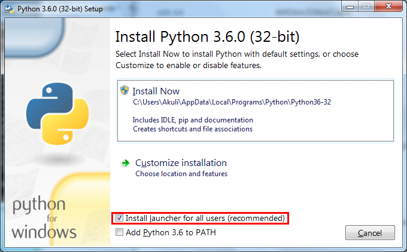

# Installing python

Python is platform-agnostic, performing seamlessly across diverse operating systems such as Windows, Mac OSX, and Linux. Despite these variations, the installation and initiation processes for Python differ based on the operating system in use. Therefore, it is advisable to adhere to the specific instructions tailored for your operating system.

## Downloading and installing python

### Windows

Installing Python on Windows is a lot like installing any other program.

1. Visit  [the official Python website](https://www.python.org/).
2. Move your mouse over the blue Downloads button, but don't click it. Then click the button that downloads the latest version of Python.

   

3. Locate the downloaded installer file (usually your Downloads folder) and double-click on it to run the installation process ou may be    prompted by the User Account Control (UAC) to allow the installation. Click Yes to proceed.

4. On the installer’s welcome screen, you’ll see two options: Install Now and Customize installation. If you want to install Python with the default settings, simply click Install Now

   

   We highly recommend checking the box next to “Add Python 3.x to PATH” before proceeding with the installation. This will ensure that Python is added to your system’s PATH variable, making it easier to run Python from the command prompt.

5. Verify the Installation with Terminal: Open the Terminal app and type the following command:

   ```python
   python3 --version
   ```

### Mac OSX

Now let’s review the steps to install Python on macOS. While macOS comes with a pre-installed version of Python, it’s usually an older version (Python 2.x) that’s no longer supported.

1. Before installing Python on macOS, it’s a good idea to check the version of Python your system currently has. macOS often comes with an older version of Python (Python 2.x) pre-installed.

   To check your system’s Python version, open the Terminal app (you can find it using Spotlight search or under Applications > Utilities) and type the following command:

   ```python
      python --version
   ```

   Press Enter, and you’ll see the version number displayed in the output like this:

   ```python
      Python 2.7.x
   ```

   If your system has Python 3.x installed, you can check its version by running the following command:

   ```python
   python3 --version
   ```

   If you’re satisfied with the installed version of Python 3.x, you can skip the remaining steps. If Python 3.x is not installed or you want to install a newer version, proceed to the next step.

2. Go to the official Python website to access the download page for the latest version of Python for macOS.

   

3. Download the macOS Installer

4. Locate the downloaded installer file (usually in your Downloads folder) and double-click on it to run the installation process.

   

   Proceed through the installation steps by agreeing to the software license agreement, choosing the installation location (we recommend using the default location), and entering your administrator password when prompted.

5. Once the installation process is completed, a folder will open on your desktop. Click IDLE in this folder.

   

6. Verify the Installation with Terminal: Open the Terminal app and type the following command:

   ```python
   python3 --version
   ```

### Linux

You already have Python 3, there's no need to install anything. You may also have Python 2, but don't try to remove it. Some of the programs that came with your operating system are probably written in Python 2, so removing Python 2 would break them.
